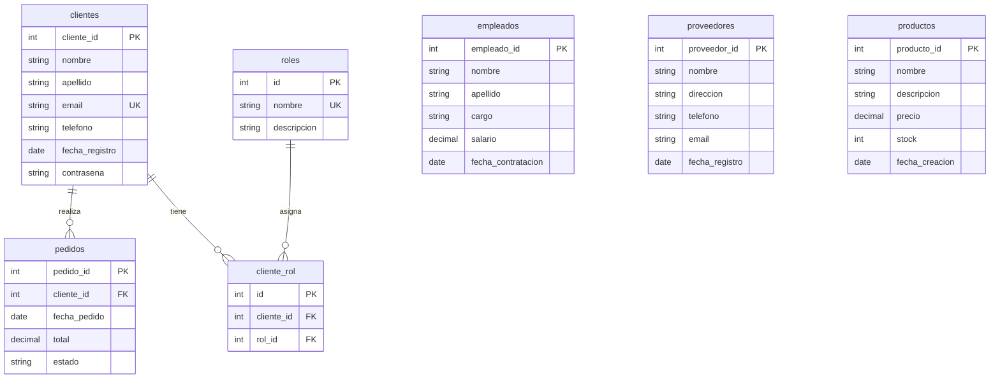

# Esquema de Base de Datos

## 🚀 Inicialización Automática

La aplicación **crea automáticamente todas las tablas** necesarias al iniciar por primera vez. No necesita ejecutar scripts SQL manualmente.

### Características:
- ✅ **Creación automática de tablas** si no existen
- ✅ **Datos de ejemplo** insertados automáticamente
- ✅ **Validaciones a nivel de BD** (constraints, índices)
- ✅ **Relaciones integridad referencial** (foreign keys)
- ✅ **Campos de auditoría** (created_at, updated_at)

## 📊 Estructura de Tablas

### 1. `roles`
Gestión de roles de usuario del sistema.

```sql
CREATE TABLE roles (
    id INT AUTO_INCREMENT PRIMARY KEY,
    nombre VARCHAR(50) NOT NULL UNIQUE,
    descripcion TEXT,
    created_at TIMESTAMP DEFAULT CURRENT_TIMESTAMP,
    updated_at TIMESTAMP DEFAULT CURRENT_TIMESTAMP ON UPDATE CURRENT_TIMESTAMP
);
```

**Datos por defecto:**
- ADMIN: Administrador del sistema
- USER: Usuario estándar  
- MANAGER: Gerente con permisos de gestión

### 2. `clientes`
Información de clientes del sistema.

```sql
CREATE TABLE clientes (
    cliente_id INT AUTO_INCREMENT PRIMARY KEY,
    nombre VARCHAR(100) NOT NULL,
    apellido VARCHAR(100) NOT NULL,
    email VARCHAR(150) NOT NULL UNIQUE,
    telefono VARCHAR(20),
    fecha_registro DATE NOT NULL,
    contrasena VARCHAR(255) NOT NULL,
    created_at TIMESTAMP DEFAULT CURRENT_TIMESTAMP,
    updated_at TIMESTAMP DEFAULT CURRENT_TIMESTAMP ON UPDATE CURRENT_TIMESTAMP
);
```

**Usuario por defecto:**
- Email: `admin@sistema.com`
- Contraseña: `admin123`

### 3. `empleados`
Registro de empleados de la empresa.

```sql
CREATE TABLE empleados (
    empleado_id INT AUTO_INCREMENT PRIMARY KEY,
    nombre VARCHAR(100) NOT NULL,
    apellido VARCHAR(100) NOT NULL,
    cargo VARCHAR(100) NOT NULL,
    salario DECIMAL(10,2) NOT NULL CHECK (salario >= 0),
    fecha_contratacion DATE NOT NULL,
    created_at TIMESTAMP DEFAULT CURRENT_TIMESTAMP,
    updated_at TIMESTAMP DEFAULT CURRENT_TIMESTAMP ON UPDATE CURRENT_TIMESTAMP
);
```

### 4. `proveedores`
Información de proveedores.

```sql
CREATE TABLE proveedores (
    proveedor_id INT AUTO_INCREMENT PRIMARY KEY,
    nombre VARCHAR(150) NOT NULL,
    direccion TEXT,
    telefono VARCHAR(20),
    email VARCHAR(150),
    fecha_registro DATE NOT NULL,
    created_at TIMESTAMP DEFAULT CURRENT_TIMESTAMP,
    updated_at TIMESTAMP DEFAULT CURRENT_TIMESTAMP ON UPDATE CURRENT_TIMESTAMP
);
```

### 5. `productos`
Catálogo de productos.

```sql
CREATE TABLE productos (
    producto_id INT AUTO_INCREMENT PRIMARY KEY,
    nombre VARCHAR(150) NOT NULL,
    descripcion TEXT,
    precio DECIMAL(10,2) NOT NULL CHECK (precio >= 0),
    stock INT NOT NULL DEFAULT 0 CHECK (stock >= 0),
    fecha_creacion DATE NOT NULL,
    created_at TIMESTAMP DEFAULT CURRENT_TIMESTAMP,
    updated_at TIMESTAMP DEFAULT CURRENT_TIMESTAMP ON UPDATE CURRENT_TIMESTAMP
);
```

### 6. `pedidos`
Registro de pedidos de clientes.

```sql
CREATE TABLE pedidos (
    pedido_id INT AUTO_INCREMENT PRIMARY KEY,
    cliente_id INT NOT NULL,
    fecha_pedido DATE NOT NULL,
    total DECIMAL(10,2) NOT NULL CHECK (total >= 0),
    estado VARCHAR(50) NOT NULL DEFAULT 'PENDIENTE',
    created_at TIMESTAMP DEFAULT CURRENT_TIMESTAMP,
    updated_at TIMESTAMP DEFAULT CURRENT_TIMESTAMP ON UPDATE CURRENT_TIMESTAMP,
    FOREIGN KEY (cliente_id) REFERENCES clientes(cliente_id) ON DELETE CASCADE
);
```

### 7. `cliente_rol`
Relación muchos a muchos entre clientes y roles.

```sql
CREATE TABLE cliente_rol (
    id INT AUTO_INCREMENT PRIMARY KEY,
    cliente_id INT NOT NULL,
    rol_id INT NOT NULL,
    created_at TIMESTAMP DEFAULT CURRENT_TIMESTAMP,
    FOREIGN KEY (cliente_id) REFERENCES clientes(cliente_id) ON DELETE CASCADE,
    FOREIGN KEY (rol_id) REFERENCES roles(id) ON DELETE CASCADE,
    UNIQUE KEY unique_cliente_rol (cliente_id, rol_id)
);
```

## 🔗 Relaciones entre Tablas



## 🔧 Configuración de Inicialización

En `database.properties`:

```properties
# Configuración de inicialización automática
db.auto.create.tables=true     # Crear tablas automáticamente
db.insert.sample.data=true     # Insertar datos de ejemplo
```

## 📋 Índices y Optimizaciones

### Índices Creados Automáticamente:
- **clientes**: email (único), nombre+apellido
- **empleados**: cargo, nombre+apellido
- **proveedores**: nombre, email
- **productos**: nombre, precio, stock
- **pedidos**: cliente_id, fecha_pedido, estado
- **cliente_rol**: cliente_id, rol_id, unique(cliente_id, rol_id)

## 🛡️ Validaciones de Integridad

- ✅ **Restricciones CHECK**: Salarios y precios no negativos
- ✅ **Claves únicas**: Email de clientes, nombre de roles
- ✅ **Claves foráneas**: Integridad referencial con CASCADE
- ✅ **Campos obligatorios**: NOT NULL en campos críticos
- ✅ **Timestamps automáticos**: created_at y updated_at

## 🚀 Primeros Pasos

1. **Configure su conexión** en `database.properties`
2. **Ejecute la aplicación** - Las tablas se crean automáticamente
3. **Use el usuario por defecto**: `admin@sistema.com` / `admin123`
4. **¡Comience a usar la aplicación!**

No necesita preocuparse por crear la base de datos manualmente. El sistema se encarga de todo automáticamente.